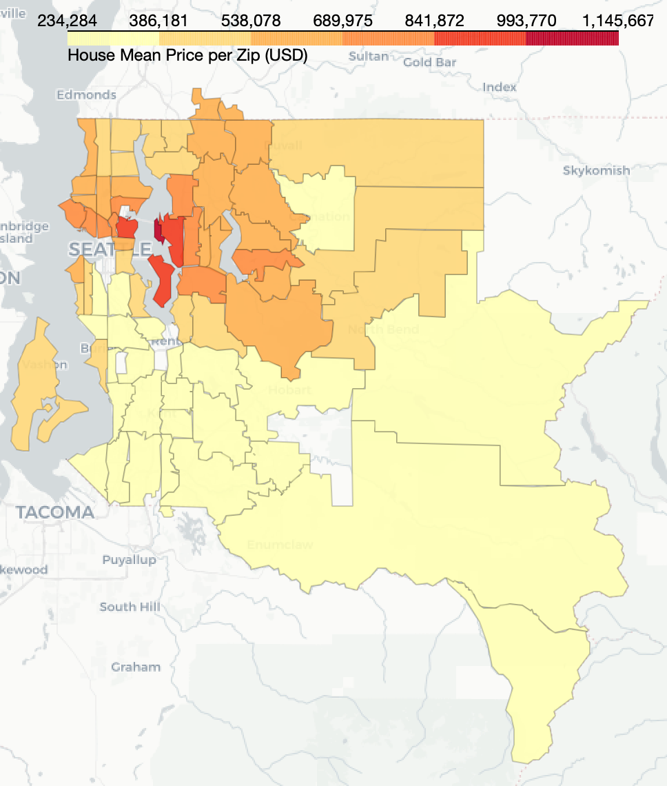
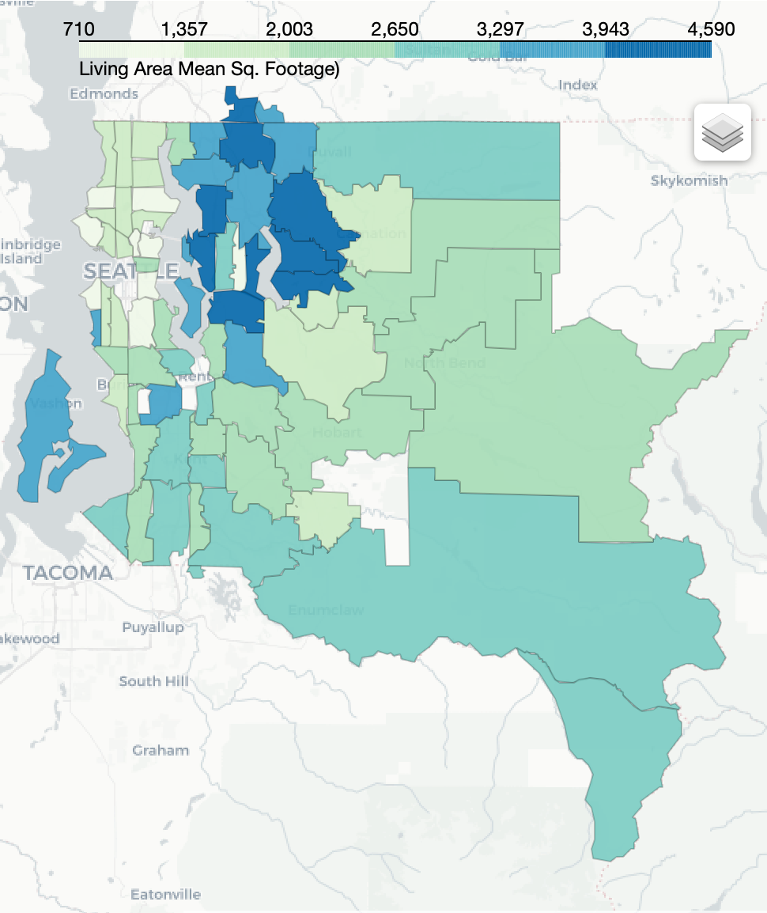
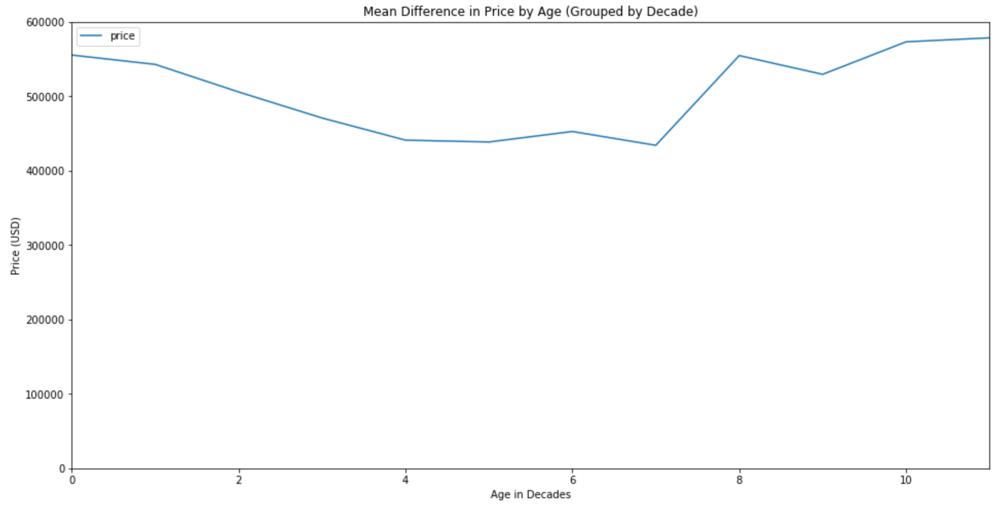
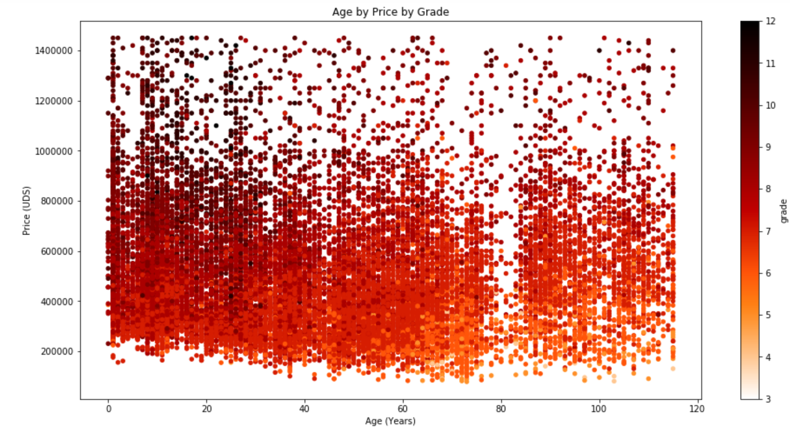
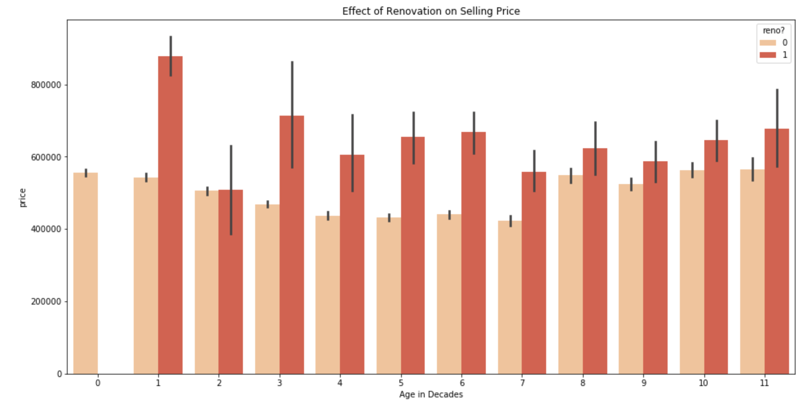

Flatiron Data Science Program

Module 2 Project - Multiple Linear Regression

October 19, 2020

---

# *King County Real Estate*

*An analysis of the King County, Washington housing market.*

---

### Overview

My client is an emerging real estate brokerage firm in King County. They are looking to expand and maximize their potential commissions. They want to know where in the county they should attempt to scout clients to maximize gross house sale prices. I will also build a linear regression model to predict housing price to help accurately price the homes they represent.

### Data

A modified version of publicly available King County housing data was provided by Flatiron. The sales records range from **05/02/2014 to 05/27/2015**. There were **21,597 sales data records**. Data preprocessing involved: correcting data types, checking for duplicates, replacing null values as appropriate, cropped outliers, and dropping or engineering new columns.

Please see my [cleaning notebook](./notebooks/Data_Cleaning.ipynb) for methodology and cleaning process.

### Questions/EDA

#### 1) Where are the most largest and expensive homes?

Full analysis: [Question 1 Notebook](./notebooks/Question_1_Where?.ipynb)

The most expensive homes are on average on the east bank of Lake Washington in the Bellevue area. This area also contains the largest homes in the data set. Bellevue spans six zipcodes, 98004-98009.

#### 2) Does home age have an effect on price?

Full analysis: [Question 2 Notebook](./notebooks/Question_2_Age?.ipynb)

Individually, age of home does not seem to be a good predictor of home price. No correlation observed. When age is grouped by decade, some age ranges show statistically different *average* prices. Using **tukey testing**, in 44 cases (of 66 comparisons) we reject the null - that the decade price means are the same.

#### 3) How do renovations effect home price?

Full analysis: [Question 3 Notebook](./notebooks/Question_3_Conditions?.ipynb)

Relationship between home age, condition, and grade were explored. Grade had the most notable correlation with price. Renovations were shown to on average, improve grade and thus increase price. Renovations completed more recently showed biggest potential for price increase. See notebook for condition and grade ranking scale (as established by King County).

#### Model

Model aims to predict the sale price based on selected features. 'Grade' and 'Sq footage of living area' were the most correlated with the target ('price'). Two series of trials were conducted using one and dropping the other for a toal of 7 iterations. 'sqft_living' created more sound models. Maximum price for homes was subset to homes under $1,000,000, lot size under 25,000 sq ft and home size under 4,000 sq ft to reduce outliers and noise. The final model used **7 total features**. The top 3 features with the greatest impact on the model were: 

    - **zipcode rank price** (an engineered 5 tier rank based on median price percentiles of all 70 zip codes) 
    - **square footage of the living area** (provided in original set)
    - **the population density of the zipcode** (sourced from King County website, in persons per sq. mile)

The train/test data split showed a difference of $642 or 0.7%, with training data being just slightly higher - therefore **the model is well fit** for housing prices from this time, but may be overfit to training data for pricing houses outside this scope. The model was succesfully cross-validated across **five K-folds** to predict house price with given features with a **mean error of $92,000**. The model statistically met **3 of 4 assumptions** required for linear regression. While the residuals visually appeared normal and homoskedastic, the model failed significance test for normality of residuals. The skew and kurtorsis were **-0.78 and 3.22**, respectively, and I considered this normal enough to proceed. 

---
### Conclusions

My client, an emerging real estate brokerage firm, may consider advertising their business in the Bellevue area in the hopes of scooping up clients in this area. Grade has the most significant effect on price observed. Renovations are a good way to improve housing grade.

The model required a reduction of data to homes **under $1,000,000** which is much less than my client intended. The data available for the mega mansions was too variable to be incorporated into this linear model. My reccomendations are for my client to begin their business in the **Bellevue area**, but to go for the more median priced homes first and work up from there. The model can predict home price for this time/area with **77% accuracy** (from the coefficient of determination, R^2) within **9.2%** of their selling price (considering a million dollar home).

### Future Work

- Investigate the return on investment for flipping houses.
- Continue engineering and iterating over the data to futher normalize residuals and increase upper price limit of model.
- Get data for appartments and condos in Seattle in addition to the single lot houses in this data set.

### Thank you for viewing my project!

Please review the full analysis in my [Jupyter Notebooks](./notebooks) or view my presentation as [slides](./MoD02presentation.pdf) or [video]().

